Welcome,

# [PROJECT 1](https://jesperba01.github.io/Project-1)

World Of Warcraft For Beginners

This website is a helping hand for new players or just people intrested in WOW(World of warcraft).
The game has been out for 19 years and is one of the largest games out there so its understable why it can be a little "much" for new people.
This website focuses more on the character and class selection part of the game so that you can get started and learn more as you progress.

Here is a mockup of the website

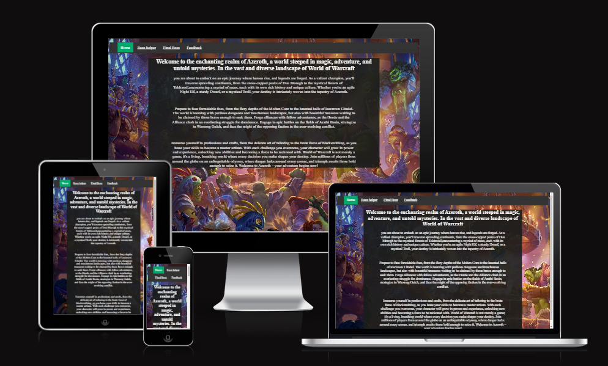

## UX

For the design i wanted to include a vibrant picture of the game and its characters but also keep it kinda dark and mysterious like the game is.
so i went whit a vibrant home page and a dark theme for the rest of the pages.

### Colour Scheme

- `#333` used for navbar
- `#04aa6d` used for navbar and links in list highlights.
- `#17130f` used for background color second, fourth and fifth page.
- `#1a1c1b` used for background color home page.
- `#FFD700` used for em highlights and tool tip.
- `#a803a6` used for em in lists.
- `white` used for primary text.

I used [coolors.co](https://coolors.co/palette/a803a6-ffd700-1a1c1b-04aa6d-333333) to generate my colour palette.

## Wireframes

To follow best practice, wireframes were developed for mobile, tablet, and desktop sizes.
I've used [Figma](https://www.figma.com) to design my site wireframes.

### Wireframes

 Click here to see the Wireframes 

Home

- 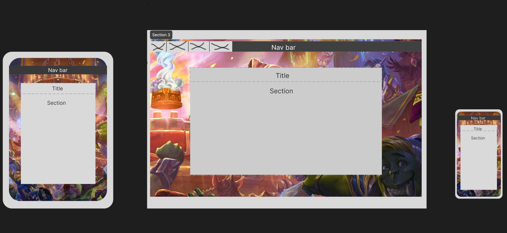

Race Helper

- 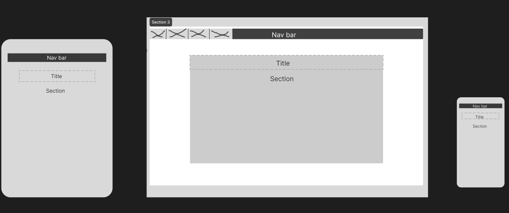

Final Boss

- 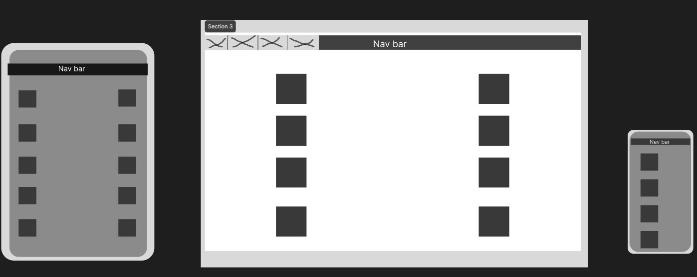

Feedback

- 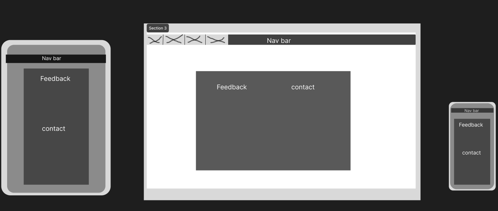

## Features

### Existing Features

- **Nav bar**

  - Navigation menu for moving between the pages.

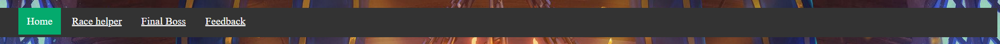

- **In pages links**

  - Links that direct you to the different sections on the page.

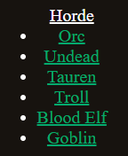

- **Links to backstory websites**

  - Links to websites whit backstory for eatch race.

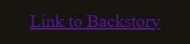

- **Abilitie info**

  - Hover feature whit info about the abilities.

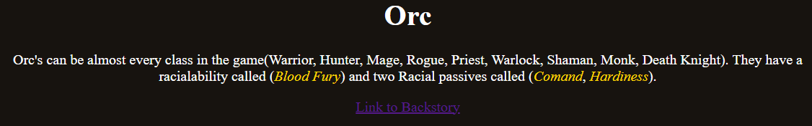
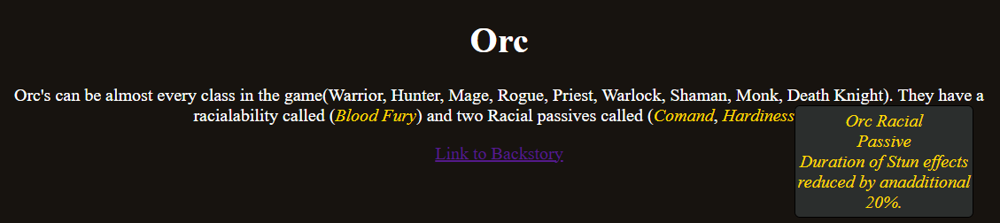

- **gear icon list**

  - picture of the gear pice and its name.

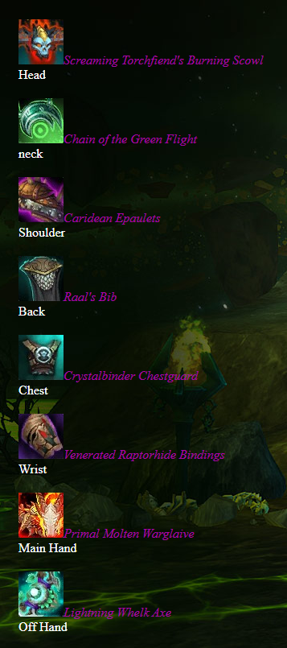

- **Feedback and contact form**

  - Feedback form and contact informantion.

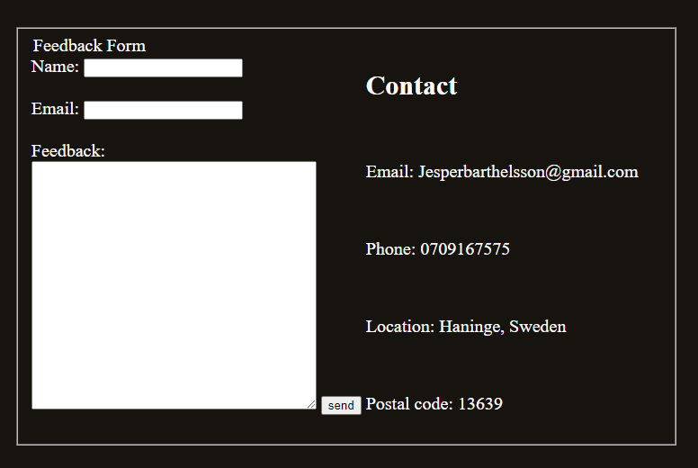

- **Search bar icon**

  - Icon next to tne adress on top of the page

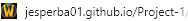

### Future Features

- Add info about alliance races #1
  - continue down on second page whit more info.
- Add backstorys #2
  - remove links to backstory websites and write my own.

## Tools & Technologies Used

- [HTML](https://en.wikipedia.org/wiki/HTML) used for the main site content.
- [CSS](https://en.wikipedia.org/wiki/CSS) used for the main site design and layout.
- [Git](https://git-scm.com) used for version control. (`git add`, `git commit`, `git push`)
- [GitHub](https://github.com) used for secure online code storage.
- [GitHub Pages](https://pages.github.com) used for hosting the deployed front-end site.
- [Codeanywhere](https://codeanywhere.com) used as a cloud-based IDE for development.
- [microsoft foton](https://apps.microsoft.com/detail/9WZDNCRFJBH4?hl=sv-se&gl=SE) used to resize pictures

## Testing

For all testing, please refer to the [TESTING.md](TESTING.md) file.

## Deployment

The site was deployed to GitHub Pages. The steps to deploy are as follows:

- In the [GitHub repository](https://github.com/jesperba01/Project-1), navigate to the Settings tab
- From the source section drop-down menu, select the **Main** Branch, then click "Save".
- The page will be automatically refreshed with a detailed ribbon display to indicate the successful deployment.

The live link can be found [here](https://jesperba01.github.io/Project-1)

### Local Deployment

This project can be cloned or forked in order to make a local copy on your own system.

#### Cloning

You can clone the repository by following these steps:

1. Go to the [GitHub repository](https://github.com/jesperba01/Project-1)
2. Locate the Code button above the list of files and click it
3. Select if you prefer to clone using HTTPS, SSH, or GitHub CLI and click the copy button to copy the URL to your clipboard
4. Open Git Bash or Terminal
5. Change the current working directory to the one where you want the cloned directory
6. In your IDE Terminal, type the following command to clone my repository:
	- `git clone https://github.com/jesperba01/Project-1.git`
7. Press Enter to create your local clone.

Alternatively, if using Gitpod, you can click below to create your own workspace using this repository.

Please note that in order to directly open the project in Gitpod, you need to have the browser extension installed.
A tutorial on how to do that can be found [here](https://www.gitpod.io/docs/configure/user-settings/browser-extension).

#### Forking

By forking the GitHub Repository, we make a copy of the original repository on our GitHub account to view and/or make changes without affecting the original owner's repository.
You can fork this repository by using the following steps:

1. Log in to GitHub and locate the [GitHub Repository](https://github.com/jesperba01/Project-1)
2. At the top of the Repository (not top of page) just above the "Settings" Button on the menu, locate the "Fork" Button.
3. Once clicked, you should now have a copy of the original repository in your own GitHub account!

### Content

| Source | Location | Notes |
| --- | --- | --- |
| [Markdown Builder](https://tim.2bn.dev/markdown-builder) | README and TESTING | tool to help generate the Markdown files |
| [Chris Beams](https://chris.beams.io/posts/git-commit) | version control | "How to Write a Git Commit Message" |

### Media

| Source | Notes |
| --- | --- |
| [Nav bar](https://www.w3schools.com/css/css_navbar.asp)| used for insperation to nav bar
| [Layout for third page](https://worldofwarcraft.blizzard.com/en-gb/character/eu/stormscale/Americancorn)| used insperation for layout
| [Background img](https://wall.alphacoders.com/big.php?i=878332)| used for backgrond on home page
| [Background img](https://worldofwarcraft.blizzard.com/en-gb/character/eu/stormscale/Americancorn2)| used for backgrond on third page
| [Hover feature](https://blog.logrocket.com/creating-beautiful-tooltips-with-only-css/)| used for insperation on hover feature

### Acknowledgements

- I would like to thank my Code Institute mentor, [Tim Nelson](https://github.com/TravelTimN) for their support throughout the development of this project.
- I would like to thank Code Institute mentor, [Julia Konovalova](https://github.com/TravelTimN) for last minut mentor session.
- I would like to thank the [Code Institute](https://codeinstitute.net) tutor team for their assistance with troubleshooting and debugging some project issues.
- I would like to thank the [Code Institute Slack community](https://code-institute-room.slack.com) for the moral support and helpfull tips