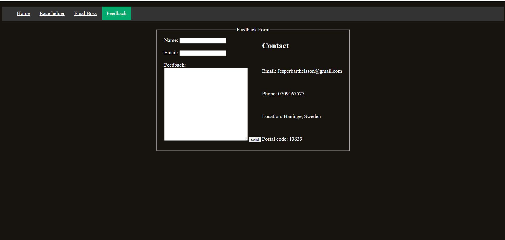

# Testing

Return back to the [README.md](README.md) file.

I've tested every aspect of the project to ensure a good user experience.
- Key testing areas include:
  - Responsive Design
  - UI and Navigation
  - HTML Structure
  - CSS Styling
  - Browser Compatibility
  - Performance

After testing, including responsiveness checks, HTML/CSS structure validation, and usability assessments, I am confident that the CSS/HTML project functions seamlessly.

## Code Validation

### HTML

I have used the recommended [HTML W3C Validator](https://validator.w3.org) to validate all of my HTML files.

| Page | W3C URL | Screenshot | Notes |
| --- | --- | --- | --- |
| Home | [W3C](https://validator.w3.org/#validate_by_input) |  | pass: No Errors|
| Race Helper | [W3C](https://validator.w3.org/#validate_by_input) |  | pass: No Errors |
| Final Boss | [W3C](https://validator.w3.org/#validate_by_input) |  | Pass: No Errors |
| Feedback | [W3C](https://validator.w3.org/#validate_by_input) |  | pass: No Errors |
| Confermation | [W3C](https://validator.w3.org/#validate_by_input) |  | Pass: No Errors |
| deployed page | [W3C](https://validator.w3.org/nu/?doc=https%3A%2F%2Fjesperba01.github.io%2FProject-1%2F) |  | Pass: No Errors |

### CSS

I have used the recommended [CSS Jigsaw Validator](https://jigsaw.w3.org/css-validator) to validate all of my CSS files.

| File | Jigsaw URL | Screenshot | Notes |
| --- | --- | --- | --- |
| style.css | [Jigsaw](https://jigsaw.w3.org/css-validator/validator?uri=https%3A%2F%2Fjesperba01.github.io%2FProject-1%2F&profile=css3svg&usermedium=all&warning=1&vextwarning=&lang=sv#css) |  | Pass: No Errors |

## Browser Compatibility

I've tested my deployed project on multiple browsers to check for compatibility issues.

| Browser | Home | Race Helper | Final Boss | Feedback | Notes |
| --- | --- | --- | --- | --- | --- |
| Chrome |  |  |  |  | Works as expected |
| Edge |  |  |  |  | Works as expected |
| Safari (mobile verson)|  |  |  |  | Minor CSS differences to button and link colors|

## Responsiveness

I've tested my deployed project on multiple devices to check for responsiveness issues.
to make it easier and test my desired devices at the same time i've used a chrome extension calle Responsive viewer that yoou can download here
[Responsive viewer](https://chromewebstore.google.com/detail/responsive-viewer/inmopeiepgfljkpkidclfgbgbmfcennb)
and another chrome extension called GoFullPage that you can fin here [GoFullPage](https://chromewebstore.google.com/detail/gofullpage-full-page-scre/fdpohaocaechififmbbbbbknoalclacl)

## Responsiveness

Tested devices: Iphone 8, plus 7, plus 6s, plus | Galaxy S9, Note 8, S8 | Ipad(standard) | Nexus 10 | Desktop |

 
Click here to see the Screenshots

- Home 
  

- Race Helper
  

- Final Boss
  

- Feedback
    
  

## Lighthouse Audit

I've tested my deployed project using the Lighthouse Audit tool to check for any major issues.

| Page | Mobile | Desktop | Notes |
| --- | --- | --- | --- |
| Home |  |  | no issues |
| Race Helper |  |  | some minor warnings about color contrast |
| Final Boss|  |  | no issues |
| Feedback|  |  | minor warning about loading time |

## Bugs

- HTML Error: `textarea` dose not cap its size

    
    

    - To fix this, I added a css abtibute called "resize" and set it to none. 

## Unfixed Bugs

There are no remaining bugs that I am aware of.